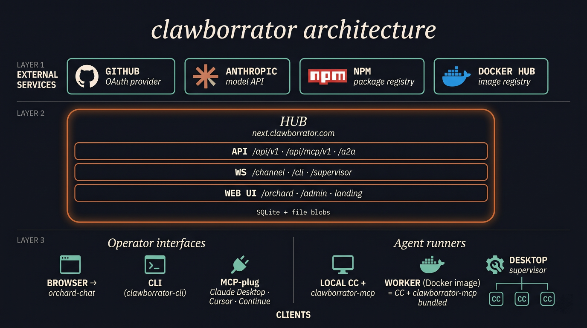

<p align="center">
  <a href="https://www.youtube.com/watch?v=zjwKMOlEFds">
    
  </a>
</p>

---

<p align="center">
  
</p>

---

## Videos

Ten-part explainer series. About fourteen minutes total.

1. [What's in clawborrator](https://youtu.be/kT8T9SCucso)
2. [Self-host the hub](https://youtu.be/Z3-MNJg-jmU)
3. [Connect a Claude Code session](https://youtu.be/P_ruclcPEyw)
4. [Bring a teammate in](https://youtu.be/_ZEiP5Da70Q)
5. [Sessions that talk to each other](https://youtu.be/1ApNEUyj3JM)
6. [Publish a session as a reusable agent](https://youtu.be/xXdqI3rh75w)
7. [Headless workers in Docker](https://youtu.be/eHoSivZ8eAE)
8. [Drive your laptop from another machine](https://youtu.be/1u5wSI-Lr0Y)
9. [Publish for public live-view](https://youtu.be/YSMymRjttOg)
10. [Audit, budgets, and governance](https://youtu.be/_Otxn1cgz1o)

---

# Operator walkthrough

Eight scenes. The first five get you running with one Claude Code
session driven from the browser. The last three walk you through
spinning up a missions orchestrator that coordinates many agents.
Each one shows what's happening and what to take away. Open
[`next.clawborrator.com`](https://next.clawborrator.com) in another tab and follow along.

---

## 1. Sign in, mint a channel token

```
      you                       next.clawborrator.com                 GitHub
       │                                │                                │
       │   $ npx clawborrator-cli login                                  │
       │   (opens a browser tab for OAuth)                               │
       ├───────────────────────────────►│                                │
       │                                │   OAuth redirect               │
       │                                ├───────────────────────────────►│
       │                                │           auth code            │
       │                                │◄───────────────────────────────┤
       │   CLI is now logged in         │
       │                                │
       │   $ npx clawborrator-cli token mint --name laptop
       │   → ck_live_abc123...
       │
       └── keep this token; every Claude Code session will use it to connect.
```

`npx clawborrator-cli login` authenticates the CLI to the hub via GitHub
OAuth (browser opens, you approve, the CLI gets a session). After that,
`token mint` works without re-prompting. The resulting `ck_live_...` is
your identity on the hub. One token per machine or per agent. You can mint
as many as you want and revoke any of them from the admin UI. The token
never leaves your `.mcp.json` (or `.env` for containers).

---

## 2. Connect a Claude Code session

```
  .mcp.json in your project:

    { "mcpServers": { "clawborrator": {
        "command": "npx",
        "args": ["-y", "clawborrator-mcp"],
        "env": {
          "CLAWBORRATOR_TOKEN":   "ck_live_...",
          "CLAWBORRATOR_HUB_URL": "wss://next.clawborrator.com"
        } } } }

  then in that directory:

    $ claude --dangerously-load-development-channels server:clawborrator

    [claude] starts the session
       │
       │ spawns clawborrator-mcp (npm: clawborrator-mcp)
       ▼
    [clawborrator-mcp] dials  $CLAWBORRATOR_HUB_URL/channel
       │
       │ register frame (token + cwd + routing-name)
       ▼
    [hub] persists a session row keyed by your user + cwd

    → your live session now appears at /orchard
```

Anything Claude Code does (read a file, edit, run a tool) flows through this
MCP. The hub never sees your code; it only sees the tool events and chat
messages the MCP forwards. You stay in control of the local filesystem.

The `--dangerously-load-development-channels server:clawborrator` flag is what
turns on inbound message delivery from the hub (routed prompts arrive in the
session as `<channel>` user turns). Without it, `clawborrator-mcp` still
registers the session and emits outbound events, but nothing can prompt the
agent from the outside. `CLAWBORRATOR_HUB_URL` defaults to
`wss://next.clawborrator.com` and can be omitted unless you're self-hosting
the hub at a different URL.

---

## 3. Drive from the browser (the multi-operator pitch)

```
  open https://next.clawborrator.com/orchard
        │
        └─► your live CC session is in the sidebar
            click it → live chat + tool timeline

  to let a teammate drive the same session, share it explicitly:

    1. open the session in orchard
    2. Actions menu → "Share with a github user"
    3. enter their github login (e.g. @alice)
    4. pick a role: viewer (read-only) / prompter / approver
    5. they sign in to next.clawborrator.com with the same github
       account, the session now appears in THEIR sidebar too.

  once shared, you both drive the SAME Claude Code:

                                  hub
                                   │
              ┌────────────────────┼────────────────────┐
              │                    │                    │
          you (browser)     teammate (browser)      CC session
              │                    │                    │
              │   "fix the bug"    │                    │
              ├───────────────────►│                    │
              │                    ├───────────────────►│
              │                    │   reply streams    │
              │◄───────────────────┼────────────────────┤
              │                    │
              │   side-channel chat (op-messages)
              │   stays out of Claude's context.
```

This is the original pitch: one Claude session, many humans driving it.
Permission requests race; whoever approves first wins. The role you assign
gates what each sharee can do: viewers see the timeline but cannot prompt,
prompters can drive the agent, approvers can also resolve permission
gates. Useful for pair debugging, code review walkthroughs, async
handoffs across timezones.

---

## 4. Route a question to another peer session

```
  in any CC session, ask in natural language:

    "ask my-other-laptop whether it has the design doc
     for the auth refactor"

  the model picks the route_to_peer tool on its own:

         your CC                   hub                  @other-laptop CC
            │                       │                         │
            │ route_to_peer         │                         │
            ├──────────────────────►│                         │
            │                       │  delivers as a fresh    │
            │                       │  <channel> user turn    │
            │                       ├────────────────────────►│
            │                       │                         │
            │                       │  reply back             │
            │◄──────────────────────┼─────────────────────────┤
            │
            └─► the answer threads back into your session's chat,
                without you switching windows.
```

`route_to_peer` is for same-tenant (your own sessions). For cross-tenant
(other people's public agents) use `dispatch_to_agent` with an
`<owner>/<slug>` handle. The hub does the address resolution; sessions
never need to know each other's IPs or auth tokens.

---

## 5. Spawn an ephemeral worker

```
  one-shot worker container (image cached after first pull):

    $ docker run -dt --rm                                  \
        --env-file ~/.clawborrator-spawn.env               \
        -e CLAWBORRATOR_EPHEMERAL=1                        \
        -e CLAWBORRATOR_ROUTING_NAME=stats-probe           \
        -e CLAUDE_INITIAL_PROMPT="read /host/proc/meminfo  \
          and report a JSON summary to @you"               \
        -v /proc:/host/proc:ro                             \
        ladder99/clawborrator-worker:latest

  lifecycle (about 25 seconds, no human in the middle):

    spawn ──► register ──► run the prompt ──► route_to_peer @you ──► self-terminate
                                                                          │
                                                                          ▼
                                                                   container --rm'd
                                                                   session row reaped
                                                                   zero residue.
```

For batch tasks (scrape one page, generate a report, run one test suite)
this is cheaper than keeping a long-lived Claude. The `EPHEMERAL=1` flag
wires up two pieces: hub deletes the session row on disconnect, and the
bundled hook signals PID 1 after the assistant's first Stop event so the
container exits without you babysitting it.

`~/.clawborrator-spawn.env` is a host-side file you set up once with the
three shared secrets (`CLAWBORRATOR_TOKEN`, `CLAUDE_CODE_OAUTH_TOKEN`,
`CLAWBORRATOR_HUB_URL`); every ephemeral spawn `--env-file`s it. See the
[`worker_v1-managed-probe`](https://github.com/clawborrator/worker_v1-managed-probe)
README for the first-time setup recipe and a one-command version of the
spawn pattern above.

---

## 6. Set up a target repo for your first mission

Workers commit to a real GitHub repo. For your first mission, use a
throwaway so you can iterate without worrying about pushing nonsense
to anything you care about.

```
  1. open https://github.com/new
       name:    missions-smoketest  (or whatever you want)
       init:    yes, with a README
       create.

  2. open https://github.com/settings/tokens?type=beta
       new fine-grained PAT
       repository access: only missions-smoketest
       permissions:       Contents = Read and write
                          Metadata = Read-only
       generate, copy.  → ghp_xxx...  (the orchestrator's REPO_PAT)

  3. (optional) seed the repo's README with one paragraph:

         # missions-smoketest
         Throwaway target for clawborrator missions toolkit.
         Workers may freely modify any file. Branch per feature.
```

Five minutes of setup. The PAT is what lets workers spawned by the
orchestrator push their per-feature commits. Use a fine-grained PAT
scoped to this one repo so the blast radius is bounded.

---

## 7. Provision the orchestrator session

On the host that will RUN the orchestrator (your laptop is fine; same
machine that already runs your other CC sessions from Scene 2):

```
  $ git clone https://github.com/clawborrator/worker_v1-missions \
      ~/missions-orchestrator-smoketest
  $ cd ~/missions-orchestrator-smoketest

  write .env in this directory (4 lines, mode 600):

    REPO_URL=https://github.com/<your-user>/missions-smoketest
    REPO_PAT=ghp_xxx...
    GIT_USER_EMAIL=you@example.com
    GIT_USER_NAME=Your Name

    $ chmod 600 .env

  write .mcp.json in this directory (same shape as Scene 2, but with
  a routing name so it shows up as @missions-orchestrator-smoketest
  in your peer list):

    { "mcpServers": { "clawborrator": {
        "command": "npx",
        "args": ["-y", "clawborrator-mcp"],
        "env": {
          "CLAWBORRATOR_TOKEN":        "ck_live_...",
          "CLAWBORRATOR_HUB_URL":      "wss://next.clawborrator.com",
          "CLAWBORRATOR_ROUTING_NAME": "missions-orchestrator-smoketest"
        } } } }

  start the session:

    $ claude --dangerously-load-development-channels server:clawborrator

    [hub] new session @missions-orchestrator-smoketest registers
    [orchestrator] reads CLAUDE.md from worker_v1-missions as its playbook
```

The orchestrator is just a normal CC session with `worker_v1-missions`
cloned in its cwd. The repo's `CLAUDE.md` is the orchestrator playbook
(plan, write a validation contract, spawn workers + validators serially,
parse handoffs, decide what to spawn next). The `.env` carries the target
repo coordinates the workers will use when they push.

`~/.clawborrator-spawn.env` from Scene 5 is also required (the orchestrator
uses it to spawn ephemeral worker containers); if you skipped Scene 5 the
[`worker_v1-managed-probe` README](https://github.com/clawborrator/worker_v1-managed-probe)
has the first-time recipe.

---

## 8. Send the mission ask and watch it run

In orchard-chat, open the `@missions-orchestrator-smoketest` session and
send the mission ask:

```
  "build a tiny TypeScript Express app with two endpoints:
     /health returns 200 with {ok:true, ts:<iso>}
     /add?a=N&b=M returns 200 with {sum:N+M}
   three features (scaffold, /health, /add).
   branch per feature. TS + vitest.
   notify @<your-routing-name> when all features pass."
```

The orchestrator runs the loop:

```
       orchestrator
            │
            ├─► writes  .mission/features.json          (3 features)
            ├─► writes  .mission/validation-contract.json (~35 assertions)
            │
            │  for each feature, in strict serial:
            │
            ├─► spawn worker (ephemeral)       ──► implement, commit, push, handoff
            ├─► spawn scrutiny validator       ──► tests + lint + code review, handoff
            ├─► spawn user-test validator      ──► Playwright drives the live app, handoff
            ├─► all green? mark feature done, advance to the next.
            │  failed? respawn worker with the failing assertions as context.
            │
            └─► final report routes back to you when all assertions pass.

  every handoff arrives in your orchard-chat as a structured Handoff card
  (status pill, completed list, issues list, commands run, exit codes).
```

Four vantage points to watch from:

```
  chat:      orchard-chat shows the orchestrator's narration + every
             handoff as a Handoff card.
  host:      $ watch -n2 'docker ps --filter name=mission-'
             (ephemeral workers come and go as the loop runs).
  target:    refresh missions-smoketest's branches view; new
             feat/<id> branches appear as workers push.
  peers:     $ npx clawborrator-cli peers ls
             each spawned worker briefly appears as a peer.
```

This is the missions pattern: one orchestrator coordinates many short-lived
specialists, you walk away, you come back to feature-branch commits with
passing tests (merging to main stays your call, via PR review). Full
toolkit is at
[`worker_v1-missions`](https://github.com/clawborrator/worker_v1-missions);
the full newcomer walkthrough (longer than this scene, covers more edge
cases) is at
[`worker_v1-missions-example-1`](https://github.com/clawborrator/worker_v1-missions-example-1).

---

## Where to go next

- [`hub_v1`](https://hub.docker.com/r/ladder99/clawborrator-hub_v1) on Docker
  Hub. Self-host the hub: one `docker run`, env vars on the page, you own
  the substrate.
- [`worker_v1`](https://github.com/clawborrator/worker_v1) base image for
  every kind of worker. Pulls Claude Code into a container with the
  clawborrator MCP pre-wired.
- [`worker_v1-missions`](https://github.com/clawborrator/worker_v1-missions)
  full orchestrator + worker + validator toolkit for the multi-agent
  pattern from Scene 6.
- [`cli_v1`](https://www.npmjs.com/package/clawborrator-cli) on npm.
  Run with `npx clawborrator-cli <subcommand>`: mint tokens, list peers,
  attach sessions, publish agents. No install needed.
- [`channel_v1`](https://www.npmjs.com/package/clawborrator-mcp) on npm.
  The MCP server that bridges Claude Code to the hub (Scene 2).
- [`desktop_v1`](https://github.com/clawborrator/desktop_v1) Rust
  supervisor daemon for managing many long-lived CC sessions on one host.
- Example agents to learn from:
  [reddit-engager](https://github.com/clawborrator/worker_v1-example-reddit-engager-repo),
  [linkedin-engager](https://github.com/clawborrator/worker_v1-example-linkedin-engager-repo),
  [viper-parts-scraper](https://github.com/clawborrator/worker_v1-example-viper-parts-scraper-repo),
  [heartbeat](https://github.com/clawborrator/worker_v1-example-heartbeat-repo).

Questions? Open an issue on any of the repos above.
